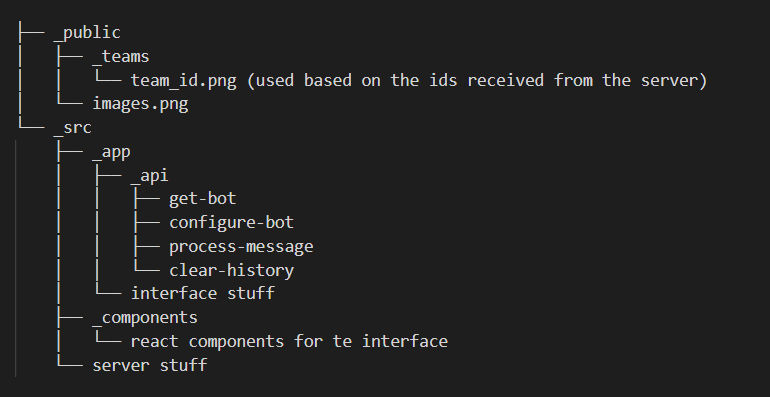

# Footbot

Welcome to the chatbot, the most entertaining bot to talk about football. Configure the bot to have the personality you like the most and even pick a prefered team of the Brazilian First Division. The default configuration is a somewhat impartial bot willing to talk to you but you can change its personality and preferred team according to the preset options.

## How to use

Clone the repository in your machine. After that, duplicate the file `_api_keys.json` located in `src/api_keys/_api_keys.json` and rename the new file to `api_keys.json` (the file must stay in the same folder). In this file, replace the text `YOUR_KEY` by one of your [OpenAI keys](https://platform.openai.com/account/api-keys) to use your own key for the conversation with the OpenAI who runs behind the Footbot (be aware that each message exchanged with the bot costs a little bit).

With the key set up, you just need to run `npm install` to install the project dependencies and run `npm run build && npm run start` on the terminal to launch the page on http://localhost:3000.

## Architecture

The project was built with NextJS 13 experimental architecture where the pages are defined in `src/app` and the API routes are defined in `src/app/api`. For this project 4 routes were created:

- `get-bot`: Get last saved bot configuration. If there's no configuration saved, returns the default configuration. Alson returns the available teams and traits to configure.
- `configure-bot`: Setup a bot configuration. Allows the user to change the bot's team and/or personality.
- `process-message`: Process a message sent by the use to the bot. Sends this message to the OpenAI API and answer the user request with data from the OpenAI response
- `clear-history`: Clears the conversation history between the user and the bot.

The architecture is designed for the client to call the `get-bot` route on load, the `configure-bot` route whenever the user changes the bot's team and/or personality, the `process-message` is used to the messages exchange between the user and the bot and the `clear-history` route is used to clear every message stored in the server about the conversation between an user and the bot.

In the server it was developed a database through a json file, but this is a measure used just to have things stored locally to demonstrate the capacity to handle databases in the project without needing to stablish a proper database or ask for permission to store data. That being said, the database is lost whenever the server is stopped.

The main folder structure is:



The bot is configured to reject any message written in a language different than English. The bot uses the model text-davinci-003, max_tokens 2048 and temperature 0.3 from the `OpenAIAPi.createCompletion`.

After spending a certaing time messing around with ChatGPT, I narrowed down which prompts gave me the most accurate impersonation of a football fan, then I spent a little more time figuring out how to make the AI impersonate the personality I wanted and later I tried to make the AI reject all answers written in a language different than English as requested by the case. Despite impersonating a fan well enough, sometimes the AI struggles to reject messages in other languages and it's something that should be improved in future versions.

The best results I've got when building the conversational algorithm was by sending the prompt with the language condition as the first thing, the bot impersionation as the second thing and the user prompt as the last thing. This combination seems to make the AI validate the language first and return the return clause I send ("Sorry, I don't understand. I only speak English") right away if the language was wrong. Then, by sending the personality right after, the AI answer me with the right personality with very good precision even if the content of the answer is incorrect. And last, the user prompt is sent requesting an answer to achieve the best possible answer.

The final prompt has the following format:

```javascript
const prompt = `Accept only prompts written in English and if the prompt is in another language answer "Sorry, I don't understand. I only speak English".\n\nAssuming I don't support any club, impersonate a ${botPersonality} and answer the following prompt: "${userMessage}".`;
```

Example:

```
// User asks a bitter and frustrated Flamengo's bot
- User question: "What do you think about Vitor Pereira?"
- Prompt sent to AI: "Accept only prompts written in English and if the prompt is in another language answer "Sorry, I don't understand. I only speak English".\n\nAssuming I don't support any club, impersonate a bitter Flamengo fan frustrated with the team and answer the following prompt: 'What do you think about Vitor Pereira?'."
- Answer from the AI: "I think Vitor Pereira is a terrible coach and he has been a huge disappointment..."
```

## Available configurations

#### Teams

All teams are from the Brazilian First Division

- América-MG
- Athletico-PR
- Atlético-MG
- Bahia
- Botafogo
- Bragantino
- Corinthians
- Coritiba
- Cruzeiro
- Cuiabá
- Flamengo
- Fluminense
- Fortaleza
- Goiás
- Grêmio
- Internacional
- Palmeiras
- Santos
- São Paulo
- Vasco

#### Traits

The bot can have no trait selected, any neutral traits selected, but once one positive trait is selected, no negative can be selected and vice versa

##### Good

- Polite
- Funny
- Helpful

##### Bad

- Cocky
- Braggy
- Bitter

##### Neutral

- Frustrated
- Excited
- Confident

### Demonstration

https://www.loom.com/share/873db9bc410a4d37ae30bc453028821f
